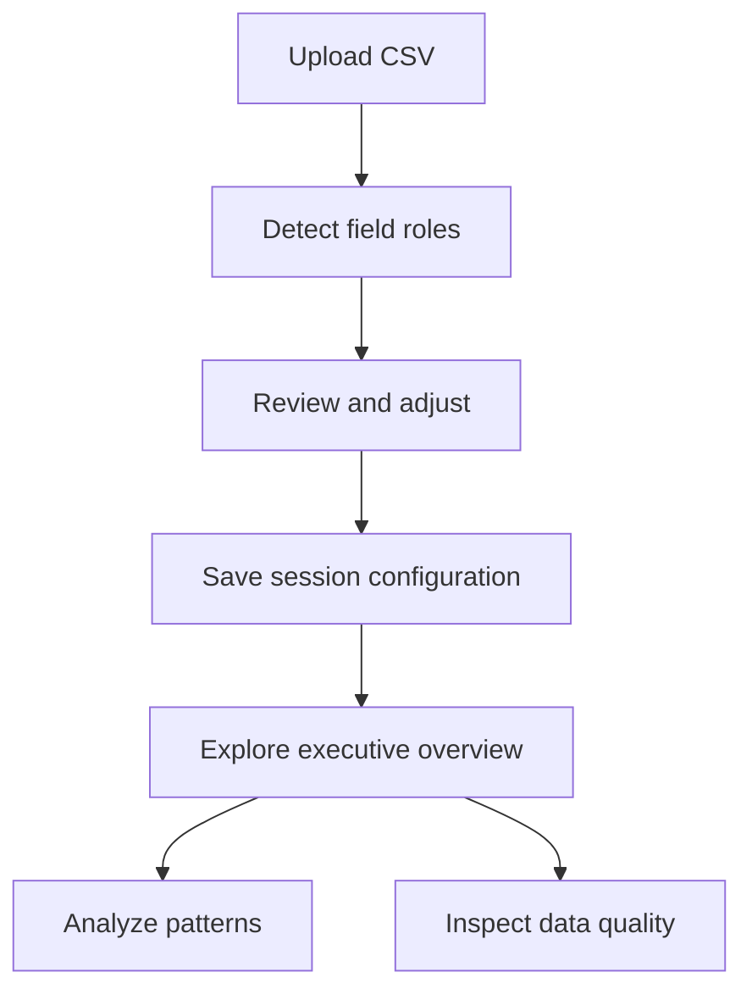

# Universal CSV Dashboard

> **Understand your business in under 60 seconds.**

Universal CSV Dashboard is a local-first analytics application that turns a
CSV file into a structured first view of the business behind it.

It is built for the moment before a formal BI project, before a polished
management report, and before an analyst has spent an hour rebuilding the same
pivots and charts. The product helps a user answer two practical questions:

> **What is in this file?**
>
> **What deserves attention?**

This document defines the product: the problem it solves, the people it serves,
the experience it should create, the capabilities that already exist, and the
direction in which it may evolve.

---

## Document status

| Field | Value |
|---|---|
| Product | Universal CSV Dashboard |
| Product stage | Foundation / active development |
| Document type | Product specification |
| Primary audience | Product contributors, maintainers and collaborators |
| Source of truth for | Product purpose, scope, users, principles and success measures |
| Related documents | [`README.md`](README.md), [`START_HERE.md`](START_HERE.md), [`ROADMAP.md`](ROADMAP.md), [`MANIFESTO.md`](MANIFESTO.md) |

Roadmap items in this document describe product direction. They are not
guaranteed release dates or commitments.

---

## 1. Executive summary

CSV is one of the most common ways business data moves between tools, teams and
clients. It is portable, familiar and easy to export. But a CSV does not explain
itself.

The person receiving it still has to determine:

- which column represents time;
- which numbers are meaningful metrics;
- which fields can be used as categories;
- whether the data contains gaps or duplicates;
- which charts are appropriate;
- whether any pattern is worth investigating;
- how to communicate the result to somebody else.

For an experienced analyst, this work is repetitive. For a business user, it
can be intimidating. For a consultant, it consumes time that could be spent on
interpretation and recommendations.

Universal CSV Dashboard compresses that first-pass workflow into one guided
experience:

1. upload a CSV;
2. review automatically detected fields;
3. confirm or adjust the configuration;
4. open an executive overview;
5. explore distributions and correlations;
6. inspect missing values and duplicate rows;
7. continue the investigation with a clearer understanding of the dataset.

The product does not try to replace every spreadsheet, notebook or BI platform.
It creates a faster and more consistent starting point.

---

## 2. The problem

### 2.1 Business data is easy to export, but slow to understand

Many business systems can export a CSV in seconds. Understanding that export
usually takes much longer.

A typical first-pass analysis includes:

- opening the file and checking whether it loads correctly;
- identifying dates, metrics, categories and IDs;
- converting columns into usable types;
- checking row counts and missing values;
- removing or investigating duplicates;
- calculating totals, averages and medians;
- creating time-series and category charts;
- inspecting distributions and correlations;
- deciding which findings matter.

None of these steps is individually difficult. Their repetition is the
problem.

### 2.2 The same setup work is repeated for every file

Analysts and consultants often rebuild the same analytical scaffolding:

- a KPI row;
- a trend chart;
- a category comparison;
- descriptive statistics;
- a correlation matrix;
- a missing-values report.

The field names change, but the first questions remain similar.

### 2.3 Tools often assume too much expertise or too much setup

Spreadsheets are flexible but manual. BI platforms are powerful but require a
model, configuration and maintenance. Notebooks are expressive but expect code.

For a quick first view, users need a smaller bridge between “I have a file” and
“I understand what this data can tell me.”

### 2.4 Charts alone do not create understanding

A dashboard can still leave the user asking:

- Why was this metric selected?
- Is the dataset trustworthy?
- Is this spike meaningful or simply an error?
- What should I investigate next?

The long-term opportunity is not merely to automate chart creation. It is to
make the analytical path more explicit, explainable and useful.

---

## 3. Product thesis

Universal CSV Dashboard is based on five beliefs.

### 3.1 Most first-pass analysis is structurally repeatable

Although business datasets differ, the first layer of investigation is often
similar: understand the schema, select the important fields, summarize the
numbers, inspect quality and reveal basic patterns.

### 3.2 Automation should propose, not silently decide

The application should detect likely dates, metrics and categories, explain its
suggestions, and allow the user to confirm or correct them.

This creates speed without hiding uncertainty.

### 3.3 Data quality belongs inside the analytical workflow

Missing values and duplicate rows are not a separate technical concern. They
change how business results should be interpreted. Quality checks should be
visible alongside metrics and charts.

### 3.4 The first useful answer matters more than the first perfect model

The product should quickly provide a coherent starting point. It should not
block the user until every edge case has been configured.

### 3.5 Local analysis is a meaningful product feature

Many CSV files contain commercial, operational or client information. Running
the application locally gives users direct control over where those files are
processed.

---

## 4. Product promise

### Core promise

> **Upload a CSV. Understand its structure. Find the next useful question.**

### Desired user outcome

After the first session, a user should be able to explain:

- what the dataset contains;
- which metric is being analyzed;
- how that metric behaves over time or across categories;
- whether missing values or duplicates require attention;
- what they should investigate next.

### North-star principle

> **Every feature must save time or improve understanding.**

If a feature adds complexity without doing either, it does not belong in the
core product.

---

## 5. Target audience

The primary audience is people who regularly receive structured business data
but do not want to rebuild a dashboard for every file.

### 5.1 Analysts

**Situation:** An analyst receives an unfamiliar export and needs a fast first
look before beginning deeper work.

**Needs:**

- quick schema orientation;
- reusable summary views;
- visible quality issues;
- a faster route to promising questions.

**Job to be done:**

> When I receive an unfamiliar CSV, help me understand its structure and
> obvious patterns so I can spend more time on interpretation.

### 5.2 Consultants and freelancers

**Situation:** A consultant receives client data and needs to prepare for a
conversation, discovery session or prototype.

**Needs:**

- a repeatable intake workflow;
- presentable first-pass visuals;
- a fast way to identify data limitations;
- local handling of potentially sensitive files.

**Job to be done:**

> When a client sends me a data export, help me establish a credible analytical
> starting point without spending hours on setup.

### 5.3 Small teams

**Situation:** A small team has useful exports but no dedicated BI stack or data
team.

**Needs:**

- a low-configuration tool;
- understandable business language;
- common KPI and quality views;
- a way to share what should be examined next.

**Job to be done:**

> When our team exports operational data, help us see the main picture without
> implementing a full analytics platform.

### 5.4 Business owners and managers

**Situation:** A decision-maker has a file but does not want to write formulas
or code.

**Needs:**

- clear headline metrics;
- familiar filters;
- readable charts;
- confidence that the data is not obviously broken.

**Job to be done:**

> When I receive a business report as a CSV, help me understand the important
> numbers and risks quickly enough to ask better questions.

### Secondary audiences

- educators demonstrating exploratory analysis;
- developers building Streamlit prototypes;
- teams evaluating a dataset before moving it into a larger system.

---

## 6. Supported business contexts

The application is intentionally domain-flexible. It adapts to detected columns
instead of requiring one fixed industry schema.

| Context | Example metrics | Example categories | Typical first questions |
|---|---|---|---|
| Retail | sales, units, margin | product, store, region | What is selling, where and when? |
| Marketing | spend, leads, conversions | channel, campaign | Which channels perform differently? |
| Finance | revenue, cost, cash flow | account, business unit | How are totals and trends changing? |
| Operations | volume, duration, defects | team, process, location | Where are workload or quality issues concentrated? |
| Inventory | stock, demand, replenishment | product, warehouse | Which items or locations deserve attention? |
| Surveys | scores, counts, ratings | segment, question | How do responses differ between groups? |

The product should remain honest about domain limits. Generic statistical
patterns are not automatically business conclusions.

---

## 7. The current product experience

### 7.1 End-to-end workflow

### 7.2 Upload & Configure

The user uploads a CSV through the browser. The application:

- accepts files up to 25 MB, the validated local-first v1.0 boundary;
- detects common encodings;
- supports comma, semicolon and tab separators;
- loads the file into a Pandas dataframe;
- reports the number of rows and columns;
- generates smart field suggestions;
- displays a data preview.

The user can review or change:

- the date or timestamp column;
- the primary numeric metric;
- additional numeric columns;
- the primary category;
- the default aggregation: sum, mean, median or count.

The product deliberately keeps the user in control. Detection accelerates
setup, while confirmation prevents a suggestion from becoming an unexplained
decision.

### 7.3 Smart Detection Engine

The engine proposes likely:

- date columns;
- primary metrics;
- category columns;
- numeric fields.

The interface also exposes confidence values and explanations so the user can
understand why fields were suggested.

### 7.4 Executive Overview

After configuration, the overview provides:

- total, average and median values for the primary metric;
- row and column counts;
- a recent-metric sparkline when a date is available;
- a time-series chart when a date is available;
- a category comparison when a category is available;
- date-range filtering;
- category filtering;
- a filtered data preview.

The page is designed for orientation, not exhaustive analysis.

### 7.5 Data Analysis

The analysis page provides:

- metric selection;
- a distribution chart;
- descriptive statistics;
- a correlation matrix when at least two numeric fields are mapped.

This page supports exploration while avoiding the complexity of a full
statistical workbench.

### 7.6 Data Quality

The quality page shows:

- row and column counts;
- duplicate-row count;
- percentage of missing cells;
- missing values by column;
- a column-level quality table;
- download of a de-duplicated CSV.

Quality information is presented as part of the product, not hidden in logs or
developer tools.

### 7.7 Reusable configuration

The current application can export the selected dashboard configuration as
JSON. This records:

- date column;
- primary metric;
- numeric columns;
- category column;
- aggregation.

Importing and reapplying a saved configuration is planned, but is not yet part
of the current product.

---

## 8. Capability status

This table separates shipped behavior from planned direction.

| Capability | Status | Notes |
|---|---|---|
| CSV upload | Available | Browser upload, validated maximum 25 MB |
| Common delimiter support | Available | Comma, semicolon and tab |
| Common encoding detection | Available | Handled during CSV reading |
| Date, metric and category suggestions | Available | User can override suggestions |
| Detection confidence and explanation | Available | Visible in the configuration flow |
| KPI overview | Available | Total, average, median, rows and columns |
| Date and category filters | Available | Shown when corresponding fields exist |
| Time-series and category charts | Available | Based on confirmed configuration |
| Distribution and descriptive statistics | Available | Per selected numeric metric |
| Correlation matrix | Available | Requires at least two numeric fields |
| Missing-value and duplicate checks | Available | Includes column-level table |
| De-duplicated CSV export | Available | Downloaded from Data Quality |
| Configuration JSON export | Available | Import is not yet supported |
| Data Quality Score | Planned | Requires a transparent scoring model |
| Rule-based executive summary | Planned | Must distinguish facts from interpretation |
| Automatic KPI and chart selection | Planned | Must remain explainable and editable |
| PDF and Excel reports | Planned | Part of the reporting stage |
| Saved project workflow | Planned | Persistence model not yet finalized |
| Optional AI explanations | Exploratory | Must include privacy and cost controls |
| Ask-your-data assistant | Exploratory | Not part of the current product |

---

## 9. Product principles

### 9.1 Automation first

Anything that can be detected reliably should be proposed automatically.

Automation should reduce setup, not remove user agency.

### 9.2 Business first

The product exists to improve decisions and questions, not to maximize the
number of charts.

Every view should have a clear business purpose.

### 9.3 Explain everything

Important suggestions, transformations and conclusions should be understandable
without reading the source code.

Confidence and uncertainty should be visible.

### 9.4 Beautiful by default

Users should receive a coherent, presentable interface without formatting it
manually.

Visual polish must support clarity rather than decoration.

### 9.5 Privacy first

Local use remains a first-class workflow. Future cloud or AI capabilities must
be optional and transparent about data handling.

### 9.6 Progressive disclosure

The first screen should be useful to a non-technical user. More detail should
be available when needed without overwhelming the default experience.

### 9.7 Honest analytics

The product must not present correlation as causation, generic patterns as
domain expertise, or uncertain detection as fact.

### 9.8 Modern engineering

Product quality depends on maintainable code, modular logic, type-safe
interfaces where practical, automated tests and documented decisions.

---

## 10. Business value

### 10.1 Time saved

The product reduces repeated setup work: schema inspection, initial KPI
calculation, basic visualization and quality checks.

The “under 60 seconds” statement is a product aspiration for reaching the first
useful understanding on a compatible dataset. It is not a guarantee for every
file, device or analytical question.

### 10.2 More consistent analysis

A repeatable workflow reduces the chance that a user forgets to check:

- duplicate rows;
- missing values;
- basic distribution shape;
- category balance;
- time coverage.

### 10.3 Better conversations

The product helps users move from “Can we open this file?” to questions such as:

- Why did the metric change during this period?
- Which category contributes most to the total?
- Are missing values concentrated in one field?
- Does the dataset support the decision we want to make?

### 10.4 Lower barrier to useful analytics

Users can begin with a CSV and Python application rather than first designing a
warehouse, semantic layer or BI implementation.

### 10.5 Faster prototypes

Consultants and developers can use the application as a reusable analytical
foundation before creating a specialized client solution.

---

## 11. Competitive position

Universal CSV Dashboard does not compete by reproducing every feature of a
spreadsheet or enterprise BI platform.

It competes on speed to first useful understanding.

| Tool | Best at | Universal CSV Dashboard advantage |
|---|---|---|
| Spreadsheets | Editing, formulas and flexible ad-hoc work | Less repeated setup for first-pass analysis |
| BI platforms | Governed models, sharing and enterprise reporting | Faster start with a single file |
| Notebooks | Custom code and deep analysis | Usable without writing code |
| Generic chart builders | Rapid visualization | Field detection and quality checks in one workflow |
| Automated profiling tools | Technical dataset inspection | Business-readable overview and guided navigation |

### Differentiators

- local-first use;
- explainable field suggestions;
- business and quality views in one workflow;
- user confirmation before analysis;
- clean presentation without manual dashboard design;
- deliberately focused product scope.

---

## 12. What the product is not

Clear boundaries protect the product from becoming unfocused.

Universal CSV Dashboard is not currently:

- a spreadsheet editor;
- a data warehouse;
- an enterprise semantic layer;
- a collaborative cloud BI platform;
- an ETL orchestration system;
- a replacement for domain experts;
- a statistical modeling suite;
- an autonomous decision-maker;
- a guarantee that uploaded data is correct;
- an AI chat product.

The application may complement these tools. It should not imitate all of them.

---

## 13. Functional requirements

### 13.1 File intake

The product should:

- accept supported CSV files through a clear upload flow;
- fail with a readable message when a file cannot be parsed;
- preserve original column names unless a transformation is explicit;
- show a preview before the user commits to a configuration;
- avoid silently discarding rows or columns.

### 13.2 Field detection

The product should:

- suggest field roles;
- expose confidence or reasoning;
- allow every important suggestion to be changed;
- handle the absence of a date or category gracefully;
- avoid treating identifiers as measures when detectable.

### 13.3 Metrics and charts

The product should:

- calculate aggregations consistently;
- label measures and axes using the selected fields;
- avoid rendering misleading charts when required fields are absent;
- keep filters synchronized with displayed metrics;
- show an empty-state message when filters remove all rows.

### 13.4 Data quality

The product should:

- report missing cells and duplicates;
- show which columns contribute to quality issues;
- distinguish observed facts from recommendations;
- keep cleaning actions explicit and reversible through download;
- never overwrite the user’s source file.

### 13.5 Export

The product should:

- use descriptive filenames;
- state what an exported artifact contains;
- avoid implying that de-duplication solves every quality issue;
- preserve data types where the export format permits.

---

## 14. Non-functional requirements

### Clarity

A first-time user should understand the next action without documentation.
Technical terms should be explained or avoided in the default interface.

### Reliability

The same file and confirmed configuration should produce consistent results.
Errors should identify the failed step and suggest a useful correction.

### Performance

Interaction should remain responsive for the supported file size on a
reasonable local development machine. Expensive operations should provide
visible progress.

### Privacy

The local application should not transmit uploaded business data to external
services by default.

### Accessibility

Information should not depend on color alone. Text, controls and chart labels
should remain legible at common zoom levels.

### Maintainability

Detection, data processing, metrics, charts, quality checks and UI composition
should remain separated enough to test and evolve independently.

---

## 15. Success framework

The product should be measured by whether it helps people reach a useful
understanding faster and with confidence.

### North-star metric

**Time to first useful understanding**

The elapsed time between selecting a compatible CSV and reaching a valid
overview that the user considers useful.

### Supporting product metrics

| Metric | What it tells us |
|---|---|
| Upload success rate | Whether supported files enter the workflow reliably |
| Configuration completion rate | Whether users can move from detection to analysis |
| Detection acceptance rate | How often suggestions are useful without correction |
| Time to overview | Whether setup is genuinely fast |
| Quality-view engagement | Whether users notice and inspect data limitations |
| Export completion rate | Whether configuration or cleaned data creates follow-on value |
| Error recovery rate | Whether users can continue after a parsing or configuration issue |
| Repeat usage | Whether the product is useful beyond a one-time demonstration |

### Quality indicators

- automated test coverage for core transformations;
- low frequency of incorrect type conversions;
- no silent loss of source rows;
- consistent totals across views;
- readable empty and error states;
- documentation that matches shipped behavior.

Targets should be set only after real usage data exists. This document defines
what to measure, not invented performance claims.

---

## 16. Product roadmap

### Foundation — reliable first-pass analysis

**Status: active**

Focus:

- dependable CSV intake;
- smart, editable field detection;
- core executive and analytical views;
- visible data-quality checks;
- consistent design and documentation.

### Understand — stronger automatic interpretation

**Status: planned**

Potential scope:

- Data Quality Score with transparent rules;
- automatic KPI selection;
- automatic chart selection;
- rule-based executive summary;
- better handling of IDs, currencies, percentages and time granularity.

### Explain — context and recommendations

**Status: planned**

Potential scope:

- explanation of why a pattern matters;
- clearer anomaly and trend context;
- recommendations tied to observed evidence;
- explicit confidence and limitations.

### Share — reusable outputs

**Status: planned**

Potential scope:

- saved configuration import;
- PDF executive report;
- Excel export;
- reusable branding;
- saved analysis or project workflow.

### Launch — stable public product

**Status: planned**

Focus:

- dependable installation;
- polished onboarding;
- accessibility and performance review;
- stable release process;
- clear support and contribution paths.

Optional AI capabilities may be explored only when they preserve explainability,
privacy controls and cost transparency.

---

## 17. Risks and mitigations

| Risk | Why it matters | Product response |
|---|---|---|
| Incorrect field detection | Can produce misleading views | Show confidence, reasoning and editable selections |
| Messy or malformed CSV files | Can block the first experience | Provide readable errors and document supported inputs |
| Overclaiming business insight | Damages trust | Separate observations, interpretations and recommendations |
| Large files on local hardware | Can reduce responsiveness | Set clear limits, show progress and optimize high-cost steps |
| Sensitive business data | Limits adoption | Keep local processing first-class and external services optional |
| Feature creep | Makes the product harder to understand | Use explicit non-goals and the north-star principle |
| Visually polished but analytically weak output | Creates false confidence | Pair every business view with quality context and testable logic |
| AI features obscuring evidence | Can invent or exaggerate conclusions | Require source-linked explanations, opt-in use and visible uncertainty |

---

## 18. Product decision filter

Before adding a feature, ask:

1. Does it reduce time to first useful understanding?
2. Does it improve the reliability of that understanding?
3. Can a non-technical user explain what it did?
4. Does the user retain control over important assumptions?
5. Does it preserve a clear local-first workflow?
6. Can it be tested independently of the interface?
7. Is it part of the core product, or better handled by an existing tool?

A feature does not need to satisfy every question perfectly. It should have a
clear reason for any trade-off.

---

## 19. Product language

The interface and documentation should sound:

- calm;
- clear;
- competent;
- practical;
- honest about uncertainty.

Prefer:

- “Suggested primary metric”
- “No date column detected”
- “12.4% of cells are missing”
- “Review these columns before continuing”

Avoid:

- “AI has understood your business”
- “Perfect prediction”
- “Guaranteed insight”
- “Your data is clean” based on one check

The product should help users feel capable, not dependent on unexplained
automation.

---

## 20. Long-term vision

Universal CSV Dashboard can grow from a reusable CSV dashboard into a broader
business-understanding assistant.

In that future, a user could:

- open an unfamiliar dataset;
- understand its structure and limitations;
- receive evidence-based observations;
- explore the reasoning behind each observation;
- produce a clear report;
- continue the work without losing analytical context.

The product should reach that future carefully. More automation is valuable
only when it remains understandable, editable and trustworthy.

---

## Final statement

Universal CSV Dashboard is not built to generate the largest possible number
of charts.

It is built to shorten the distance between a file and a useful business
conversation.

> **Save hours. Not spreadsheets.**
