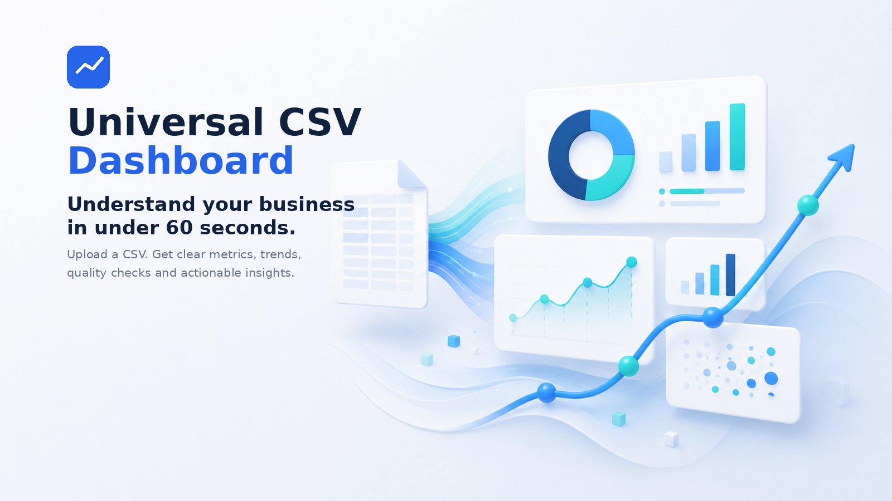
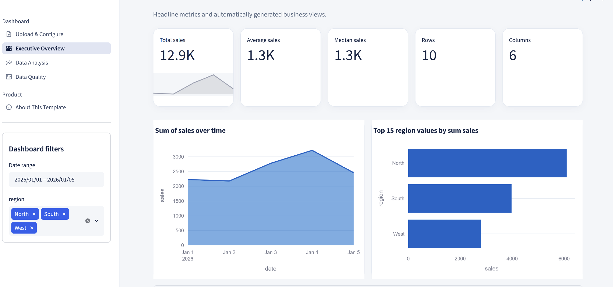
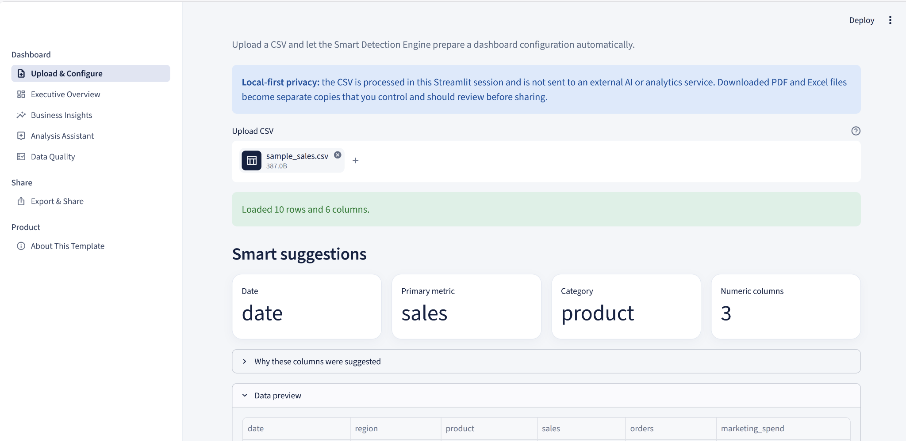
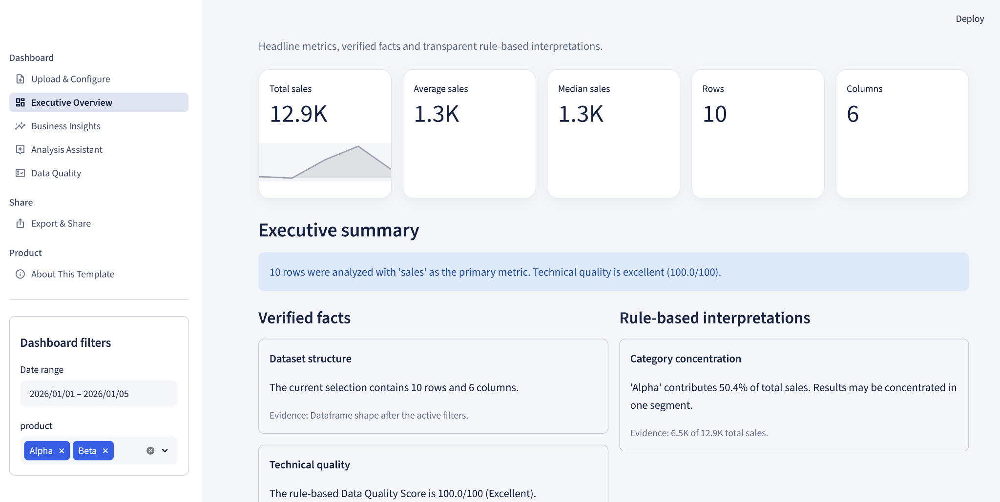
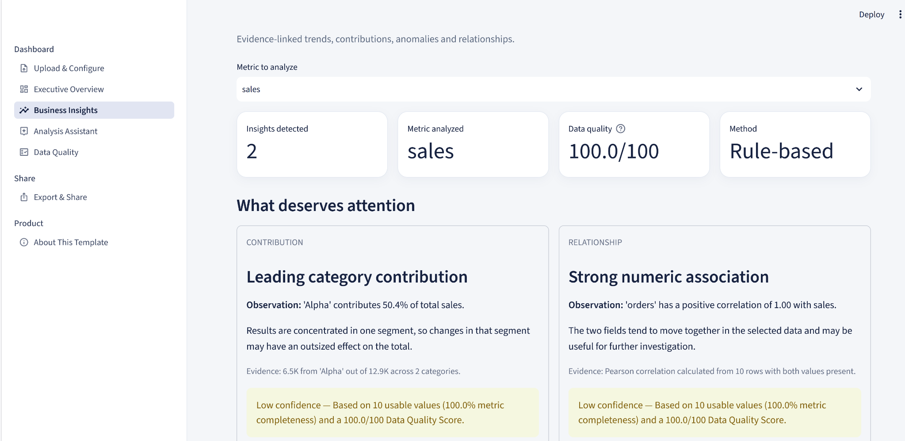
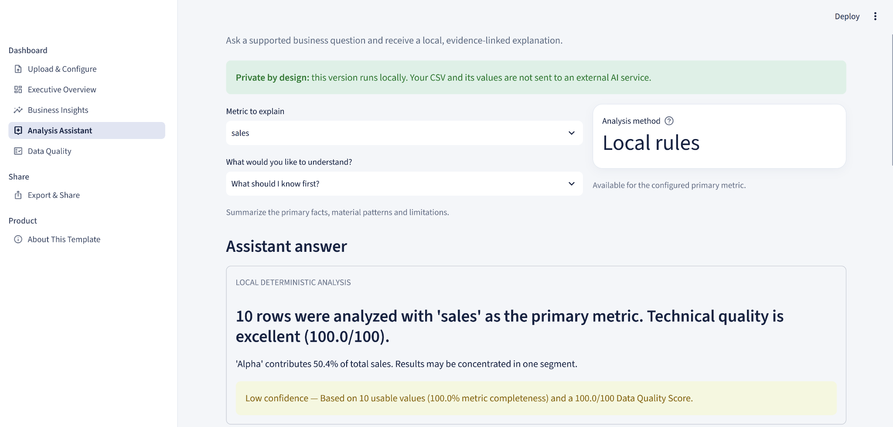
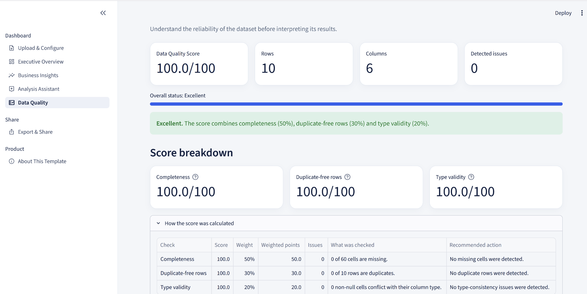
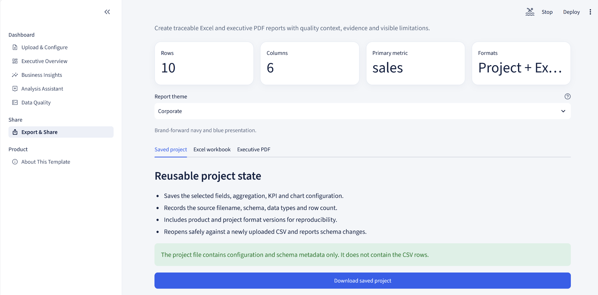
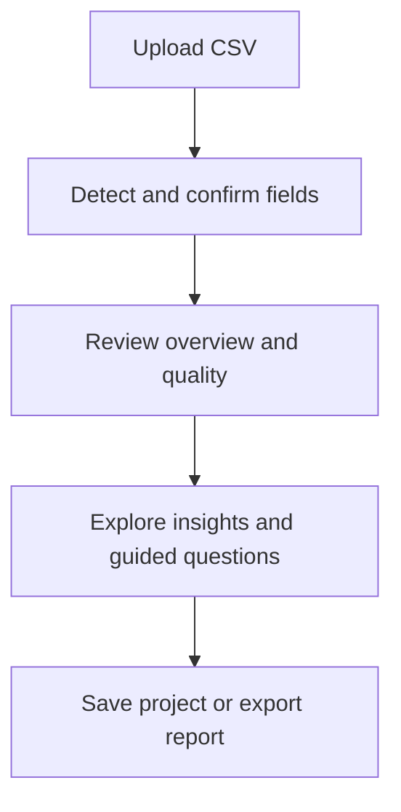

<p align="center">
  
</p>

<h1 align="center">
  Understand your business in under 60 seconds.
</h1>

<p align="center">
  <strong>
    Upload a CSV and turn it into clear metrics, trends, data-quality checks
    and interactive business views — without building a dashboard from scratch.
  </strong>
</p>

<p align="center">
  <a href="https://github.com/lialit/Universal-CSV-Dashboard/actions/workflows/ci.yml"></a>
  <a href="https://github.com/lialit/Universal-CSV-Dashboard/actions/workflows/documentation-links.yml"></a>
  <a href="https://github.com/lialit/Universal-CSV-Dashboard/releases/latest"></a>
  <a href="./START_HERE.md"></a>
  <a href="./LICENSE"></a>
  <a href="./docs/12_SECURITY_PRIVACY.md"></a>
</p>

<p align="center">
  <strong><a href="./START_HERE.md">Run locally</a></strong> ·
  <strong><a href="https://github.com/lialit/Universal-CSV-Dashboard/releases/latest">Stable release</a></strong> ·
  <strong><a href="./SUPPORT.md">Get support</a></strong>
</p>

<p align="center">
  <a href="#what-you-get">Features</a> ·
  <a href="#product-preview">Preview</a> ·
  <a href="#quick-start">Quick start</a> ·
  <a href="#documentation">Documentation</a> ·
  <a href="#contributing">Contributing</a>
</p>



## Business data is easy to export. Understanding it is not.

The usual workflow starts with a CSV and quickly turns into manual cleaning,
pivot tables, chart formatting and repeated questions about what the numbers
actually mean.

Universal CSV Dashboard shortens that path:

- upload a CSV;
- confirm the detected fields;
- review verified executive facts and rule-based interpretations;
- inspect evidence-linked business insights and data quality;
- ask supported questions in the local Analysis Assistant;
- save the project or export a traceable Excel or PDF report;
- filter the results;
- decide what to investigate next.

It is designed for analysts, consultants, small teams and business owners who
need a useful first view of a dataset without setting up a BI project.

## What you get

| | Capability | Outcome |
|---|---|---|
| 📊 | **Executive Overview** | Recommended KPIs, verified facts and transparent rule-based interpretations |
| ✨ | **Automatic field detection** | Editable date, metric and category suggestions with visible reasoning |
| 📈 | **Business Insights** | Traceable trend, contribution, anomaly and relationship observations |
| 🧭 | **Analysis Assistant** | Local guided questions, calculation explanations and evidence-based summary drafts |
| ✅ | **Data Quality** | A transparent score with missing, duplicate and type-validity components |
| 📤 | **Export & Share** | Reusable project JSON plus branded, traceable Excel and executive PDF reports |
| 🎛️ | **Useful filters** | Focus by date and detected categorical fields |
| 🔒 | **Local-first workflow** | Run the app on your own machine and keep control of the file |

## Product preview


The demo shows the local-first starting workflow: upload a representative CSV,
review the detected fields and inspect the recommended dashboard composition.



The interface is intentionally calm and consistent: a focused navigation rail,
clear KPI cards, useful filters and business-readable chart titles.

### Product gallery

| Upload & Configure | Executive Overview |
|---|---|
|  |  |

| Business Insights | Analysis Assistant |
|---|---|
|  |  |

| Data Quality | Export & Share |
|---|---|
|  |  |

## Why not start in a spreadsheet?

Spreadsheets remain excellent for direct editing and detailed ad-hoc work.
Universal CSV Dashboard is for the earlier question: **“What is in this file,
and what deserves attention?”**

| Traditional first-pass analysis | Universal CSV Dashboard |
|---|---|
| Rebuild the same pivots and charts | Reusable automatic analysis |
| Decide every field manually | Field detection with user confirmation |
| Check missing data separately | Transparent Data Quality Score and issue details |
| Interpret every chart from scratch | Evidence, confidence and limitations shown together |
| Lose context in screenshots | Saved project state and traceable Excel/PDF reports |
| Send data to a general AI tool | Deterministic local guidance without an external AI service |

## How it works



The application separates data understanding from presentation. Detection and
analysis live in reusable modules; deterministic calculations produce the
quality score, insights and assistant answers; Streamlit views render the
results into a consistent interface.

## Quick start

### Requirements

- Python 3.11+
- `pip`

The validated v1.0 upload boundary is **25 MB per CSV**. CSV processing and
analysis run in memory, so wider datasets can require substantially more RAM
than their file size.

### Install and run

```bash
git clone https://github.com/lialit/Universal-CSV-Dashboard.git
cd Universal-CSV-Dashboard

python -m venv .venv
```

Activate the environment:

```bash
# Windows PowerShell
.\.venv\Scripts\Activate.ps1

# macOS / Linux
source .venv/bin/activate
```

Install the dependencies and launch the app:

```bash
pip install -r requirements.txt
streamlit run app.py
```

Open the local address shown by Streamlit, upload a CSV, and review the detected
configuration before exploring the dashboard.

For a reproducible versioned installation, use the published
[latest stable release](https://github.com/lialit/Universal-CSV-Dashboard/releases/latest).
For setup problems or usage questions, follow [`SUPPORT.md`](SUPPORT.md).

## Try these pages first

1. **Upload & Configure** — load a file, inspect detected fields and adjust the
   recommended dashboard composition.
2. **Executive Overview** — scan KPIs, verified facts, rule-based
   interpretations and visible limitations.
3. **Business Insights** — investigate evidence-linked trends, category
   contributions, unusual values and numeric relationships.
4. **Analysis Assistant** — ask a supported local question, inspect its
   calculation, follow suggested questions and draft a reviewable summary.
5. **Data Quality** — understand the score components, missing cells,
   duplicate rows and column health.
6. **Export & Share** — save project state or create a themed Excel workbook
   and executive PDF with methodology and quality context.

Sample files are available in `sample_data/`.

## Built for many business contexts

| Retail | Marketing | Finance | Operations |
|---|---|---|---|
| Sales and product mix | Campaign and channel results | Revenue and cost trends | Volume and service metrics |
| Inventory signals | Lead and conversion patterns | Budget monitoring | Workload patterns |

The dashboard adapts to the columns it finds rather than assuming one fixed
industry schema.

## Project structure

```text
UniversalCSVDashboard/
├── app.py                  # Streamlit entry point
├── app_core/               # Detection and analysis logic
├── views/                  # Application pages and UI composition
├── sample_data/            # Safe example datasets
├── tests/                  # Automated checks
├── assets/                 # Brand, screenshots and visual resources
├── docs/                   # Product and engineering documentation
├── examples/               # Usage examples
├── releases/               # Release notes and release assets
├── marketing/              # Reusable launch materials
├── .streamlit/             # Streamlit configuration
└── requirements.txt
```

## Product principles

**Automation first.** Detect what can be detected, then let the user confirm.

**Business first.** A chart is useful only when it helps answer a real question.

**Explain everything.** Labels and summaries should be understandable without
reading the source code.

**Beautiful by default.** A useful report should not require manual formatting.

**Privacy first.** Local use should remain a first-class way to analyse a file.

## Technology

- [Streamlit](https://streamlit.io/) for the application experience
- [Pandas](https://pandas.pydata.org/) for data processing
- [Plotly](https://plotly.com/python/) for interactive visualisation
- [OpenPyXL](https://openpyxl.readthedocs.io/) for structured Excel reports
- [ReportLab](https://www.reportlab.com/) and
  [pypdf](https://pypdf.readthedocs.io/) for verified PDF reporting
- Python 3.11+ for the core application

## Documentation

| Document | Purpose |
|---|---|
| [`START_HERE.md`](START_HERE.md) | Installation, first product tour and setup troubleshooting |
| [`SUPPORT.md`](SUPPORT.md) | Bugs, usage help, feature requests and security routing |
| [`PRODUCT.md`](PRODUCT.md) | Product scope, audience and value |
| [`MANIFESTO.md`](MANIFESTO.md) | Principles that guide product decisions |
| [`ROADMAP.md`](ROADMAP.md) | Planned product stages |
| [`releases/README.md`](releases/README.md) | Release plans, readiness criteria and version status |
| [`docs/`](docs/) | Architecture, UX, brand and product documentation |
| [`docs/branding/BRAND_BOOK.md`](docs/branding/BRAND_BOOK.md) | Visual identity and usage rules |
| [`docs/12_SECURITY_PRIVACY.md`](docs/12_SECURITY_PRIVACY.md) | Local data flow, export privacy and security boundaries |
| [`docs/11_ENGINEERING_QUALITY.md`](docs/11_ENGINEERING_QUALITY.md) | Test, CI, dependency and readiness gates |
| [`docs/13_PERFORMANCE_BOUNDARY.md`](docs/13_PERFORMANCE_BOUNDARY.md) | Validated CSV size boundary and repeatable smoke-test procedure |

## Roadmap

| Version | Stage | Goal | Status |
|---|---|---|---|
| `0.1–0.2` | **Foundation** | Reliable upload, detection and core views | Delivered |
| `0.3` | **Understand** | Transparent quality scoring and executive interpretation | Delivered in the current codebase |
| `0.4` | **Explain** | Evidence-linked insights with confidence and limitations | Delivered in the current codebase |
| `0.5` | **Share** | Saved project state and responsible report exports | Delivered in the current codebase |
| `0.6` | **Assist** | Deterministic local guidance with inspectable calculations | Delivered in the current codebase |
| `1.0` | **Launch** | Stable, documented and dependable public product | Released as `v1.0.0` |

See [`ROADMAP.md`](ROADMAP.md) for the working plan. Roadmap items describe
direction, not guaranteed release dates. Delivered `0.3–0.6` work is included
in the stable `v1.0.0` release; those milestones were not published as separate
Git tags.

## Contributing

Contributions and thoughtful feedback are welcome. Please read
[`CONTRIBUTING.md`](CONTRIBUTING.md) before opening a pull request.

When reporting an issue, include:

- the expected and actual behaviour;
- a minimal, non-sensitive sample CSV when possible;
- your Python version and operating system;
- the full error message.

Use [`SUPPORT.md`](SUPPORT.md) to choose the correct route before opening an
issue. Security vulnerabilities must use the private process in
[`.github/SECURITY.md`](.github/SECURITY.md).

## License

See [`LICENSE`](LICENSE) for the project licence.

## Author

Created by **Olena Havrylova**  
[GitHub profile](https://github.com/lialit)

---

<div align="center">

### Save hours. Not spreadsheets.

Run the app locally, review the stable release, or choose the correct support route above.

</div>
