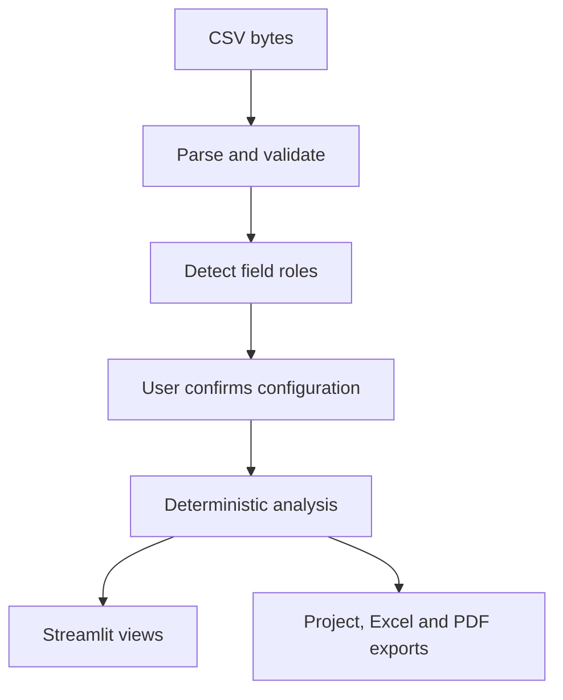

# Architecture

Universal CSV Dashboard is a local-first Streamlit application. The interface
is deliberately thin: reusable modules in `app_core/` perform parsing,
detection, calculations, quality checks, explanations and exports; modules in
`views/` compose those results into pages.

## Runtime flow

The uploaded CSV is parsed from session bytes into a pandas DataFrame. The
application does not intentionally create a row-level temporary upload file or
send the values to an external AI or analytics service.

## Main layers

| Layer | Location | Responsibility |
|---|---|---|
| Entry point | `app.py` | Page configuration, theme and sidebar navigation |
| Views | `views/` | Streamlit controls, feedback, page composition and downloads |
| Session state | `app_core/state.py` | Active DataFrame, file name and confirmed configuration |
| Input | `app_core/data.py`, `csv_parser.py` | CSV byte parsing and the enforced 25 MB boundary |
| Detection | `smart_detection.py`, `configuration.py` | Candidate date, metric, category and numeric fields |
| Analysis | `metrics.py`, `quality.py`, `insights.py` | Deterministic calculations over configured data |
| Explanation | `executive_summary.py`, `assistant.py`, `calculation_explainer.py` | Evidence-linked facts, interpretations and calculation context |
| Sharing safety | `summary_drafts.py`, `claim_guard.py` | Draft structure and unsupported-claim screening |
| Visualisation | `charts.py`, `overview_data.py` | Plotly figures and bounded browser-side data preparation |
| Persistence and exports | `project_state.py`, `exports.py`, `pdf_exports.py` | Project JSON, Excel and executive PDF generation |
| Presentation | `theme.py`, `report_themes.py`, `formatting.py` | Application and report styling |

## State and result reuse

The active DataFrame and configuration live in Streamlit session state. A
lightweight result cache in `app_core/session_cache.py` reuses derived results
for the same in-memory DataFrame and small configuration keys. It does not hash
or copy the complete DataFrame on every page revisit. Preparing a new DataFrame
clears the derived session results.

Full-data KPI, quality and insight calculations use the complete supported
dataset. Browser-side distribution rendering is bounded to a deterministic,
explicitly labelled sample of at most 50,000 values when needed.

## Trust boundaries

- Field detection is a suggestion; the user confirms or edits the mapping.
- Data Quality describes observable technical properties, not truth or fitness
  for a business decision.
- Insights and assistant answers are deterministic screening rules, not causal
  or predictive claims.
- Confidence labels describe evidence reliability and retain limitations.
- Saved projects contain configuration and schema metadata, not CSV rows.
- Excel may contain row-level data; executive PDF intentionally does not.
- Every export should be reviewed before external sharing.

See `docs/12_SECURITY_PRIVACY.md` for the complete data-flow and deployment
boundary.

## Change guidance

Keep calculations independent from Streamlit where practical. A behavioral
change should normally include:

1. an update to the relevant `app_core/` module;
2. focused automated tests;
3. a thin view integration;
4. updated public documentation when behavior or limits change;
5. successful Ruff, pytest, security and release-readiness checks.
